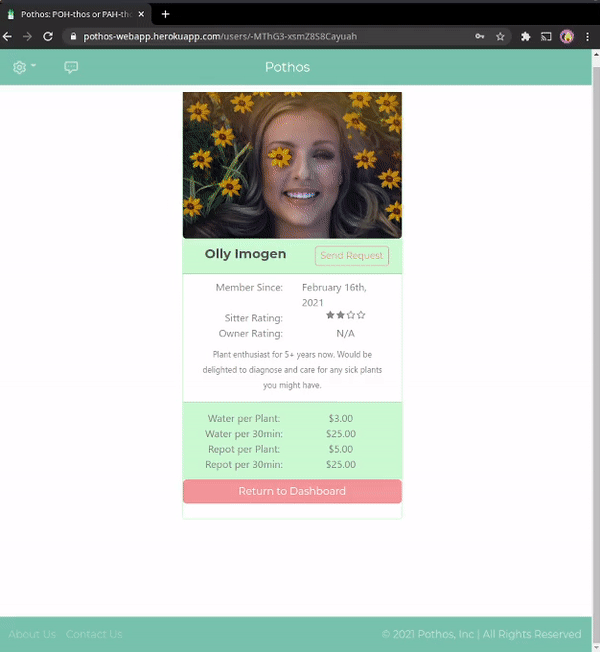
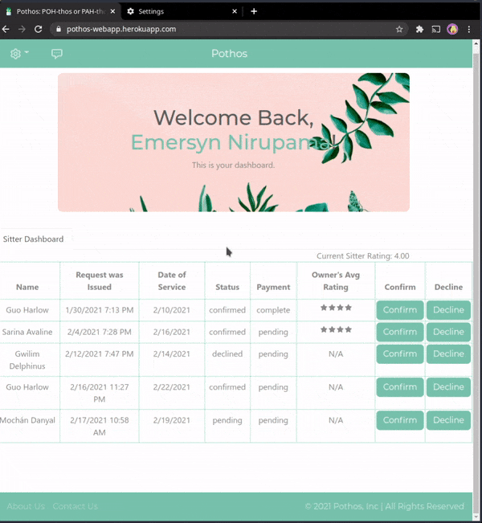

# Pothos

Pothos is the #1 plant sitting and houseplant services app. Get trusted houseplant care in your neighborhood. The Pothos app was created for plant people by plant people (but not in a scary sci fi way). Through the app, get photo updates, an easy way to message sitters or manage your business, and a secure way to book and pay.

### Table of Contents
  - [Link to Demo](#link-to-demo)
  - [Getting Started as a Plant Owner](#getting-started-as-a-plant-owner)
  - [Getting Started as a Plant Sitter](#getting-started-as-a-plant-sitter)
  - [Technologies](#technologies)
  - [Road Map](#road-map)
  - [Contributing](#contributing)
  - [License](#license)

---

## Link to Demo
Visit bit.ly/pothosapp[https://www.youtube.com/watch?v=nuI_cBAGn38&t=13s] to view a demo given by the Pothos developers.

## Getting Started as a Plant Owner

- Sign up for an account with [Pothos](https://pothos-webapp.herokuapp.com/login).
- Fill out your user profile as a plant owner (or as both a plant owner and plant sitter!)
- Browse the full list of registered plant sitters 
  + Tip: you can view the map to find a plant sitter closest to you!
  

- Select a plant sitter and send them a request.<!--    -->
- Now that you've been connected with your potential plant sitter, it's up to them to confirm/decline the request and it's up to the two of you to coordinate the details of the plant sitting (including payment) through your inbox!

## Getting Started as a Plant Sitter

- Sign up for an account with [Pothos](https://pothos-webapp.herokuapp.com/login).
- Fill out your user profile as a plant sitter (or as both a plant owner and plant sitter!)  
- Browse your list of plant sitting requests and confirm or deny requests on your dashboard. 
- Coordinate the details of a plant sitting request through chat threads in your inbox. *Each plant sitting request will create a new chat thread.*  
  

---

## Technologies

[Pothos web application](https://github.com/cescarez/pothos-react) and [Pothos API](https://github.com/cescarez/pothos-flask) was created with:
Core Technology | version
-----------|-------
Python | 3.9.1
Flask | 1.1.2
JavaScript | ECMAScript2018
React | 17.0.1

Library | version
-----------|-------
react-bootstrap | 1.4.3
bootswatch | 4.6.0
node-sass | 4.14.1
react-icons | 4.1.0
react-router-dom | 5.2.0
axios | 0.21.1
moment | 2.24.0
@react-google-maps | 2.1.1
@react-firebase/auth | 0.2.10
@stripe/react-stripe-js | 2.2.2
@stripe/stripe-js | 1.12.1
gunicorn | 20.0.4
Pyrebase4 | 4.4.3
stripe | 2.55.2

External API | Tool
--------------| ------
Firebase | Authentication  Realtime Database  Storage
Google Maps | JS Maps  Geocoding
USPS | Address Verification
Stripe | Payment

## Road Map
* Payments: Complete Stripe integration for in-app payments
* Owner Dashboard: List of plant sitters to be sorted by distance to owner
* Inbox: Badge for unread messages
* Request List: Styling for pending/unconfirmed requests.
* Owner Dashboard: Pagination of list of sitters.
* Sitter Dashboard: Map of owners that have sent requests (marker color == request status)
* Authentication: OAuth integration

## Contributing
Pull requests are welcome. For major changes, please open an issue first to discuss what you would like to change.

## License
This software is licensed under the [GPL license](https://choosealicense.com/licenses/gpl-3.0/).   
:seedling: *Copyright (c) 2021 Jessica Chan and Christabel E. Sebastian*
